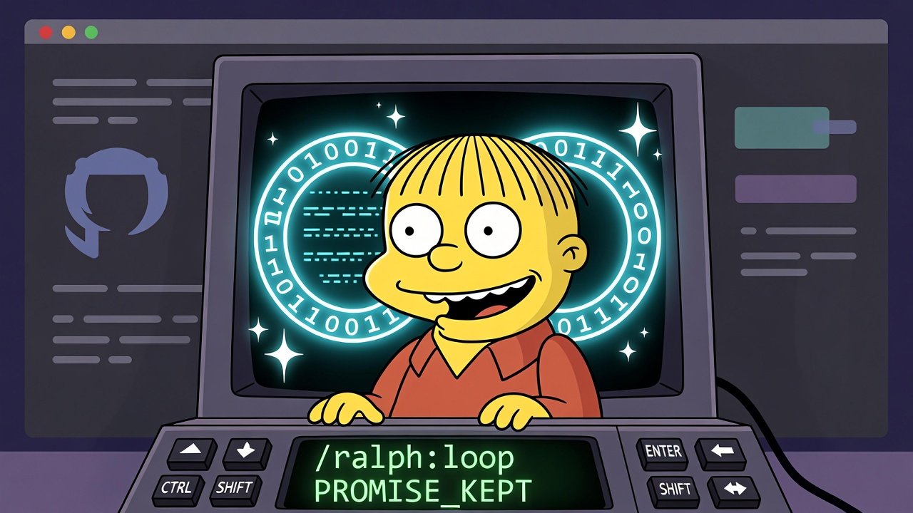

# Ralph Wiggum Extension for Gemini CLI

This extension implements the "Ralph Wiggum" technique for iterative, self-referential AI development loops within the Gemini CLI.



## What is the Ralph Wiggum Technique?

The Ralph Wiggum technique is a development methodology based on continuous AI agent loops. As its creator, Geoffrey Huntley, describes it, "Ralph is a Bash loop"—a simple `while true` that repeatedly feeds an AI agent the same prompt, allowing it to iteratively improve its work until a task is complete.

This extension brings that power directly into your Gemini CLI session, using an `AfterAgent` hook to create a self-referential feedback loop.

### Core Concept

The loop happens **across agent turns**, explicitly controlled by the extension's hook.

-   The **`AfterAgent` hook (Controller)** runs after each turn. It evaluates whether the loop should terminate (e.g., max iterations reached, completion promise met). 
-   **Loop Continuation:** If the loop needs to continue, the hook instructs the CLI to start a new turn and provides a `systemMessage` containing the original prompt. This ensures the agent remains focused on the original task.
-   **User Interjection:** The loop gracefully handles user interruptions. If you submit a new prompt, the loop detects the change and pauses to address your input before automatically resuming the task on the next agent turn.

This creates a **self-referential feedback loop** where:
-   The original task context is maintained via system messages.
-   The agent's previous work (modified files, git history) persists.
-   Each iteration allows the agent to see the current state of the codebase and improve upon its past work.

## Quick Start

Before running the loop, ensure all necessary script files have execute permissions. This is crucial if you copied the extension files manually or if permissions were not preserved during transfer:

```bash
chmod +x ~/.gemini/extensions/ralph-wiggum/scripts/*.sh
chmod +x ~/.gemini/extensions/ralph-wiggum/hooks/*.sh
```

Now, you can start the Ralph loop:

```bash
/ralph:loop "Build a REST API for a to-do list. Requirements are: full CRUD operations, input validation, and unit tests. Output the phrase 'PROMISE_KEPT' when all tests pass and the API is fully functional." --completion-promise "PROMISE_KEPT" --max-iterations 25
```

Gemini will:
-   Iteratively implement the API.
-   Add and run tests, see failures, and debug them.
-   Refactor code based on previous attempts.
-   Continue until all requirements are met and it outputs the completion promise.

## Configuration

This extension requires hooks to be enabled in your Gemini CLI configuration (usually `~/.gemini/gemini.json`). Add the following flags to your configuration file:

```json
{
  "tools": {
    "enableHooks": true
  },
  "hooks": {
    "enabled": true,
    "disabled": [
      "tool-logger"
    ]
  }
}
```

## Commands

### `/ralph:loop`

Starts a Ralph loop in your current session.

**Usage:**
```bash
/ralph:loop "<prompt>" [--max-iterations <n>] [--completion-promise "<text>"]
```

**Options:**
-   `--max-iterations <n>`: (Recommended) Automatically stop the loop after N iterations. Defaults to 0 (unlimited).
-   `--completion-promise "<text>"`: A specific string that, when detected in the model's output, will stop the loop.

### `/ralph:cancel`

Manually cancels the active Ralph loop.

**Usage:**
```bash
/ralph:cancel
```

## Prompt Writing Best Practices

The success of the Ralph Wiggum technique depends heavily on well-crafted prompts.

### 1. Clear Completion Criteria

Provide a clear, verifiable definition of "done." The `--completion-promise` is crucial for this.

**Good:**
```
/ralph:loop "Build a REST API for todos. When all CRUD endpoints are working and all tests pass with >80% coverage, output the text '<promise>TASK_COMPLETE</promise>'." --completion-promise "TASK_COMPLETE"
```

### 2. Use Safety Hatches

Always use `--max-iterations` as a safety net to prevent infinite loops if a task is unclear or impossible.

```bash
# Set a reasonable iteration limit
/ralph:loop "Attempt to refactor the authentication module." --max-iterations 20
```

### 3. Encourage Self-Correction

Structure your prompt to guide the agent through a cycle of work, verification, and debugging.

**Good:**
```
Implement feature X by following TDD:
1. Write failing tests for the feature.
2. Implement the code to make the tests pass.
3. Run the test suite.
4. If any tests fail, analyze the errors and debug the code.
5. Refactor for clarity and efficiency.
6. Repeat until all tests are green.
7. When complete, output the phrase 'TESTS_PASSED'.
```

## When to Use This Technique

**Good for:**
-   Tasks with clear, automatable success criteria (e.g., passing tests, a linter running clean).
-   Greenfield projects where the agent can build from scratch.
-   Iterative refinement, such as refactoring or achieving a target test coverage.

**Not good for:**
-   Vague or open-ended tasks requiring human judgment.
-   One-shot operations or simple questions.
-   Live debugging in a production environment.

## Learn More

-   **This Extension's Internal Context:** See `GEMINI.md` for the context provided to the model during sessions.
-   Original Technique by Geoffrey Huntley: [ghuntley.com/ralph/](https://ghuntley.com/ralph/)
-   Official Gemini CLI Extensions Documentation: For details on building and understanding Gemini CLI extensions, refer to the official documentation.
